# РФСнаб — B2B/B2C e-commerce платформа

**Микросервисная торговая платформа для оптовой и розничной продажи спецодежды и СИЗ.**
Работает в продакшене: каталог ~16 000 SKU, двусторонний обмен с 1С, ежесуточный импорт от поставщика, автоматический деплой из `master`.

🔗 **Живой проект: [rfsnab.ru](https://rfsnab.ru)**


---

## Содержание

- [О проекте](#о-проекте)
- [Возможности](#возможности)
- [Архитектура](#архитектура)
- [Технологический стек](#технологический-стек)
- [Быстрый старт](#быстрый-старт)
- [Структура репозитория](#структура-репозитория)
- [Разработка](#разработка)
- [Тестирование](#тестирование)
- [CI/CD и деплой](#cicd-и-деплой)
- [Инженерные решения](#инженерные-решения)
- [Скриншоты](#скриншоты)

---

## О проекте

Платформа заменила устаревший сайт оптового поставщика средств индивидуальной защиты. Ключевое отличие от типового интернет-магазина — **двойной режим работы**: один и тот же пользователь может покупать как физлицо (B2C, розничные цены) и как представитель организации (B2B, оптовые цены, юрлица, счета), переключаясь между контекстами без повторной авторизации.

Каталог не заводится руками: товары приезжают из двух источников — учётной системы **1С** (формат CommerceML) и **FTP поставщика** (XML-классификатор + XLS-номенклатура). Заказы уходят обратно в 1С для выставления счетов.

Проект реализован и поддерживается в одиночку: от проектирования схемы БД и микросервисной декомпозиции до настройки VPS, Nginx, SSL и автоматического деплоя.

**Масштаб кодовой базы**

| Метрика | Значение |
|---|---|
| Java-классов (production) | 453 |
| Java-классов (тесты) | 109 |
| Тестовых методов `@Test` | ~880 |
| REST-контроллеров | 39 |
| HTTP-эндпоинтов | 195 |
| Flyway-миграций | 53 |
| TypeScript/TSX-модулей | 99 |
| Микросервисов | 8 + frontend |

---

## Возможности

**Каталог и товары**
- Дерево категорий произвольной вложенности, рекурсивный подсчёт товаров
- Варианты товаров (размер, цвет) с наследованием категории от родителя
- **Фасетные фильтры** по атрибутам товара с кэшированием агрегатов в Redis и graceful degradation при недоступности кэша
- Полнотекстовый поиск с пагинацией и «подъёмом» варианта к родительской карточке
- Drag-and-drop сортировка товаров и категорий в админке (одним batch-запросом на весь уровень)
- Хранение изображений в Yandex Object Storage (S3-совместимое API), генерация превью

**Пользователи и доступ**
- JWT: access-токен 15 минут, refresh-токен 30 дней, ротация при обновлении
- Регистрация с подтверждением e-mail, повторная отправка письма с rate-limit 10 минут
- Сброс пароля по e-mail (enumeration-safe: ответ не раскрывает существование аккаунта)
- OAuth2-вход через Яндекс с получением подтверждённого телефона
- Юридические лица с ручной верификацией менеджером, привязка нескольких юрлиц к аккаунту
- Переключение контекста B2C ↔ B2B без смены `userId`

**Заказы**
- Корзина: Redis как быстрый слой + PostgreSQL как источник истины
- **14 статусов заказа** с state machine и явным набором финальных состояний
- Редактирование заказа клиентом из личного кабинета до перехода в работу
- Способы получения: доставка / самовывоз, разные наборы обязательных полей
- Событийная модель на Kafka: `order-events`, `order-1c-export`, `legal-entity-events`, `user-events`, `price-list-requests`
- Оплата через Точка Банк (карта и СБП)(пока отключена функция)

**Интеграции**
- **1С CommerceML**: приём каталога, выгрузка заказов и контрагентов по протоколу `/1c-exchange/`
- **Импорт от поставщика**: ночной cron забирает XML-классификатор и XLS-номенклатуру по FTP, скачивает изображения, делает upsert по внешнему идентификатору
- Асинхронная обработка изображений отдельным воркером, чтобы не блокировать импорт
- Прайс-листы по категориям, генерируемые по запросу через Kafka

**Уведомления**
- Kafka-consumer + HTML-письма на Thymeleaf-шаблонах: подтверждение регистрации, смена статуса заказа, сброс пароля

---

## Архитектура

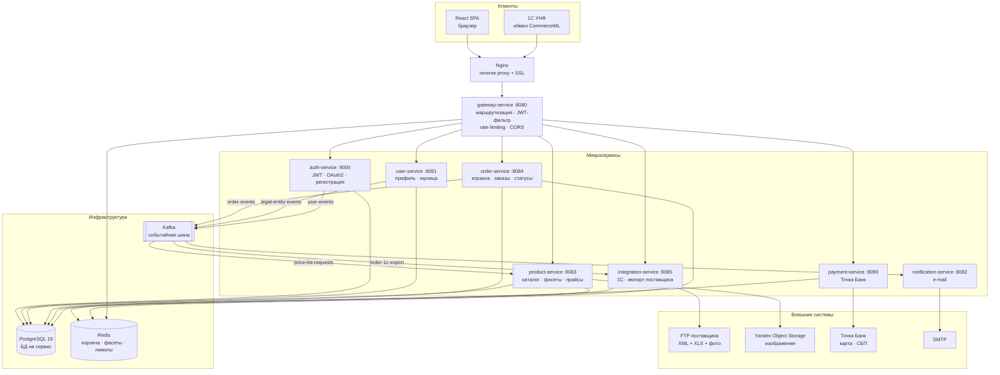

### Сервисы

| Сервис | Порт | Зона ответственности |
|---|---|---|
| `gateway-service` | 8080 | Единая точка входа. Валидация JWT, проброс `X-User-Id` / `X-User-Role` / `X-Client-Type`, rate limiting на Redis, CORS |
| `auth-service` | 9000 | Выпуск и обновление JWT, регистрация B2C/B2B, верификация e-mail, сброс пароля, OAuth2 Яндекс, переключение контекста |
| `user-service` | 8081 | Профиль пользователя, юридические лица и их верификация, административное управление пользователями |
| `product-service` | 8083 | Каталог, дерево категорий, варианты, атрибуты и фасеты, изображения, избранное, прайс-листы |
| `order-service` | 8084 | Корзина, оформление и жизненный цикл заказа, административная работа с заказами |
| `notification-service` | 8082 | Kafka-consumer, рендеринг и отправка HTML-писем |
| `integration-service` | 8085 | Обмен с 1С, импорт каталога поставщика, обработка изображений |
| `payment-service` | 8090 | Платежи Точка Банк (карта, СБП) |
| `frontend` | 5173 dev / 3000 prod | React SPA: витрина, личный кабинет, админ-панель |

Каждый сервис владеет собственной схемой БД — прямых обращений к чужим таблицам нет, взаимодействие только через HTTP и Kafka.

---

## Технологический стек

| Слой | Технологии |
|---|---|
| Язык и платформа | Java 21, Spring Boot 3.5, Spring Cloud Gateway 2025.0 |
| Данные | PostgreSQL 16, Flyway, Spring Data JPA, Hibernate |
| Кэш и очереди | Redis, Apache Kafka |
| Безопасность | Spring Security, JWT (jjwt 0.12), OAuth2 Client |
| Маппинг и кодогенерация | MapStruct 1.5, Lombok |
| Документация API | springdoc-openapi (Swagger UI) |
| Тестирование | JUnit 5, Mockito, AssertJ, Testcontainers 1.20, WireMock, JaCoCo |
| Frontend | React 19, TypeScript 5.9, Vite 8, Ant Design 6 |
| Frontend-состояние | Zustand 5, TanStack Query 5 |
| Frontend-формы | react-hook-form + zod |
| Frontend-прочее | dnd-kit, recharts, framer-motion, axios |
| Инфраструктура | Docker, Docker Compose, Nginx, GitHub Actions |

---

## Быстрый старт

### Требования

- Docker и Docker Compose
- JDK 21 и Maven — только для локальной сборки без контейнеров
- Node.js 20+ — только для dev-режима фронтенда

### Запуск всего стека

```bash
git clone https://github.com/elims777/ecommerce-platform.git
cd ecommerce-platform/infra

cp .env.example .env   # заполнить переменные окружения
docker compose up -d
```

После старта:

| Что | Адрес |
|---|---|
| Витрина | http://localhost:3000 |
| API через gateway | http://localhost:8080 |
| Swagger UI сервиса | `http://localhost:<порт сервиса>/swagger-ui.html` |

### Только инфраструктура (для запуска сервисов из IDE)

```bash
cd infra
docker compose up -d user-db product-db order-db notification-db integration-db redis kafka
```

### Frontend в dev-режиме

```bash
cd frontend
npm install
npm run dev        # http://localhost:5173, проксирует /api на gateway
```

> Все секреты — только через переменные окружения. В репозитории нет ни одного захардкоженного пароля, токена или ключа.

---

## Структура репозитория

```
ecommerce-platform/
├── gateway-service/        # Spring Cloud Gateway: маршруты, JWT-фильтр, rate limiting
├── auth-service/           # аутентификация, JWT, OAuth2, верификация e-mail
├── user-service/           # профили, юридические лица
├── product-service/        # каталог, категории, фасеты, изображения, прайс-листы
├── order-service/          # корзина, заказы, state machine статусов
├── notification-service/   # Kafka-consumer, e-mail на Thymeleaf
├── integration-service/    # 1С CommerceML, импорт с FTP поставщика
├── payment-service/        # эквайринг Точка Банк
├── frontend/               # React 19 + TypeScript + Ant Design
│   └── src/
│       ├── api/            # axios-клиент, refresh-логика при 401
│       ├── features/       # admin · cart · catalog · checkout · favourites · orders · priceLists · profile
│       ├── pages/          # страницы верхнего уровня
│       ├── store/          # Zustand: authStore, cartStore
│       └── components/     # переиспользуемый UI
├── infra/                  # docker-compose (prod и dev), nginx.conf
├── docs/screenshots/       # скриншоты интерфейса для README
├── .github/workflows/      # CI/CD pipeline
├── ARCHITECTURE.md         # модель данных и детали архитектуры
└── pom.xml                 # родительский Maven-модуль
```

---

## Разработка

### Backend

```bash
mvn clean verify                    # сборка и все тесты
mvn clean package -DskipTests       # быстрая сборка

mvn clean verify -pl product-service                              # один модуль
mvn test -pl product-service -Dtest=ProductServiceTest            # один класс
mvn test -pl product-service -Dtest=ProductServiceTest#shouldReturnProduct   # один метод
```

### Frontend

```bash
cd frontend
npm run dev       # dev-сервер
npm run build     # production-сборка (tsc -b && vite build)
npm run lint      # ESLint
```

### Пересборка сервиса в локальном docker-стенде

```bash
mvn clean package -pl product-service -am -DskipTests
cd infra && docker compose -f docker-compose.dev.yml up -d --build product-service
```

### Конвенции кода

- Constructor injection, `@Autowired` на полях не используется
- `@RestControllerAdvice` с глобальным обработчиком исключений в каждом сервисе
- Сущности не покидают слой контроллера — только DTO, маппинг через MapStruct
- Явное управление границами транзакций через `@Transactional`
- AOP-логирование, SLF4J + Logback, чувствительные данные не логируются
- Никаких magic numbers — константы и enum'ы
- Конфигурация только через `application.yml` и переменные окружения

---

## Тестирование

| Уровень | Инструменты | Что покрывается |
|---|---|---|
| Unit | JUnit 5, Mockito, AssertJ | Бизнес-логика сервисов, мапперы, валидаторы |
| Slice | `@WebMvcTest`, `@DataJpaTest` | Контроллеры, репозитории, сериализация |
| Integration | Testcontainers (PostgreSQL, Kafka, Redis) | Полный путь запроса, миграции Flyway, событийные сценарии |
| Внешние API | WireMock | Gateway и интеграции с внешними системами |

Покрытие собирается JaCoCo, отчёты выгружаются артефактом каждого CI-прогона.

```bash
mvn clean verify        # ~880 тестов
```

---

## CI/CD и деплой

Полностью автоматизированный pipeline в GitHub Actions — от пуша до работающего продакшена, без ручных шагов.

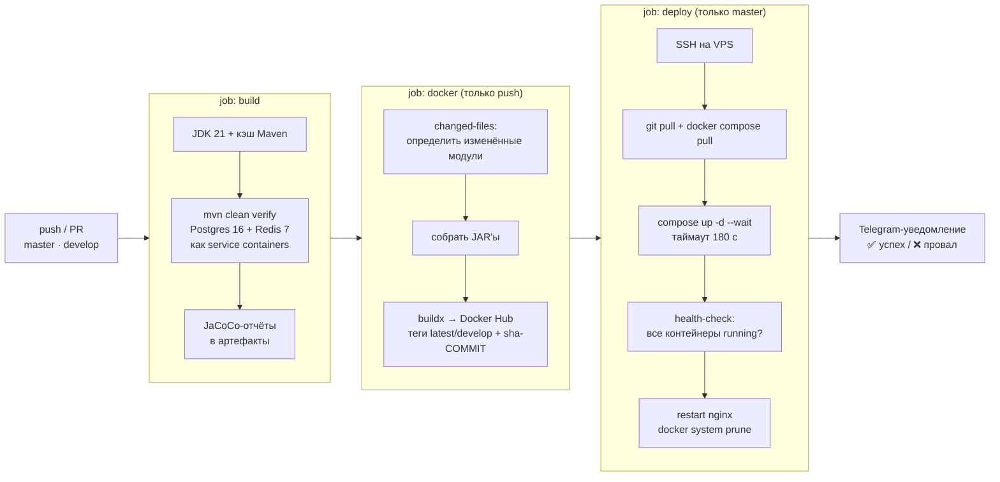

**Что здесь важного**

- **Инкрементальная сборка образов.** `tj-actions/changed-files` определяет, какие модули затронуты, и пересобирает только их. При изменении корневого `pom.xml` или пуше в `master` пересобирается всё.
- **Двойное тегирование образов**: подвижный тег (`latest` / `develop`) для деплоя и неизменяемый `sha-<commit>` — для точного отката к любой ревизии.
- **Деплой с проверкой.** `docker compose up -d --wait` ждёт healthcheck'и; затем `docker compose ps` разбирается через `jq`, и если хоть один контейнер не в статусе `running` — job падает с ошибкой, а не «зеленеет» молча.
- **Миграции применяются сами.** Flyway прогоняет схему при старте каждого сервиса — отдельного шага миграции в pipeline нет и не нужно.
- **Обратная связь в Telegram** с SHA коммита, автором, текстом коммита и ссылкой на workflow run — и на успех, и на провал.
- **Секреты** (доступ к Docker Hub, SSH-ключ VPS, токен Telegram-бота) хранятся в GitHub Secrets.

**Ветвление:** `develop` — интеграционная ветка, образы с тегом `develop`; `master` — продакшен, автодеплой. Feature-ветки мержатся в `develop` через `--no-ff`.

Прод: VPS под Ubuntu, Nginx как reverse proxy с SSL, весь стек в Docker Compose.

---

## Инженерные решения

Несколько решений, которые стоит пояснить — они выглядят нетипично, но приняты осознанно.

**Варианты товара — это дочерние `Product`, а не отдельная сущность.**
Изначально существовала таблица `product_variants`. От неё отказались: поставщик присылает варианты как самостоятельные позиции со своими артикулом, ценой, остатком и фотографиями — то есть как полноценные товары. Отдельная сущность требовала дублирования почти всех полей `Product` и разветвления логики в поиске, корзине и заказах. Сейчас вариант — это `Product` с флагом `isVariantChild` и ссылкой `parentProductId`. Одна модель, один поисковый индекс, одна логика цен.

**Корзина живёт в Redis и в PostgreSQL одновременно.**
Redis обслуживает частые операции добавления и изменения количества, PostgreSQL остаётся источником истины и переживает перезапуск. Корзина доступна только авторизованным пользователям — для B2B это норма: без определённого типа клиента невозможно показать корректную цену.

**Кэш фасетов деградирует мягко.**
Агрегаты фасетных фильтров кэшируются в Redis, но `CacheErrorHandler` перехватывает ошибки соединения: при недоступности Redis фильтры считаются напрямую из БД, а каталог продолжает работать. Отказ кэша не должен ронять витрину.

**Импорт идёт через upsert по внешнему идентификатору.**
Товары из разных источников не конфликтуют благодаря схеме внешних ключей: 1С — UUID, поставщик — `FTK-{артикул}`, варианты поставщика — `FTK-{артикул.NNN}`. Повторный импорт обновляет существующие записи, а не создаёт дубликаты. Slug генерируется только при создании товара, чтобы URL карточек не менялись после каждого ночного прогона (важно для SEO).

**Цены в модели товара.**
`price` — оптовая цена (B2B), `wholesalePrice` — розничная (B2C). Один товар несёт обе цены; какая показывается покупателю, определяет `clientType` из JWT — переключение контекста B2C ↔ B2B меняет отображаемую цену без пересчёта каталога.

---

## Скриншоты

### Витрина

| | |
|---|---|
| **Главная** | **Каталог с фасетными фильтрами** |
| [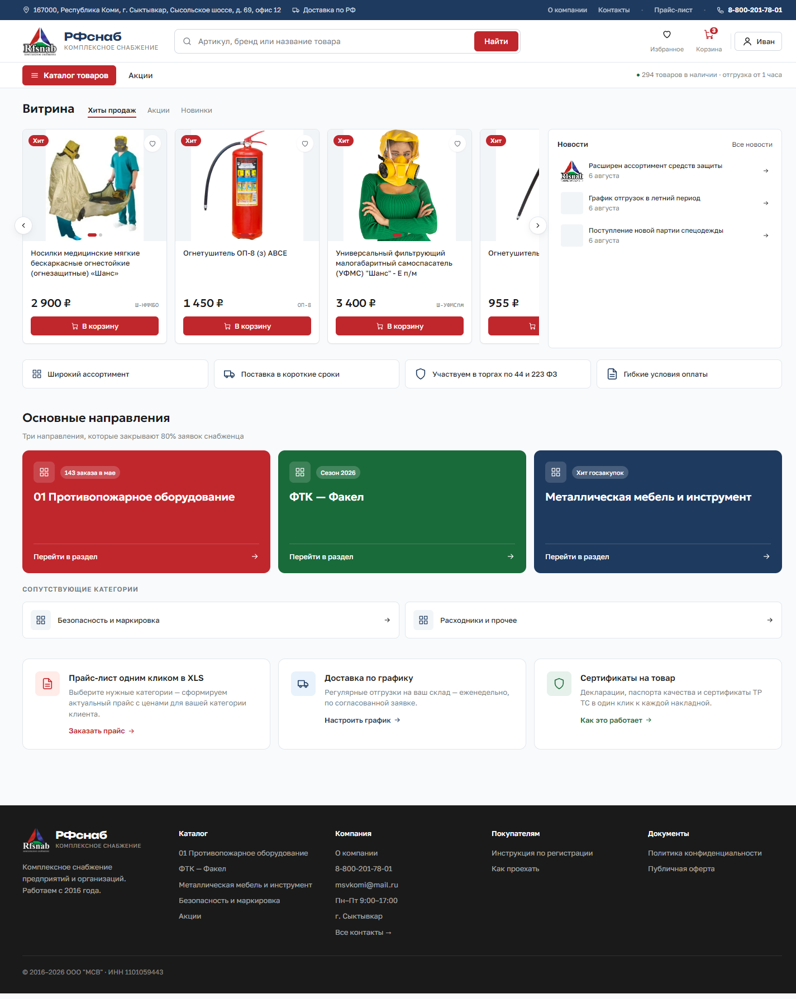](docs/screenshots/01-home.png) | [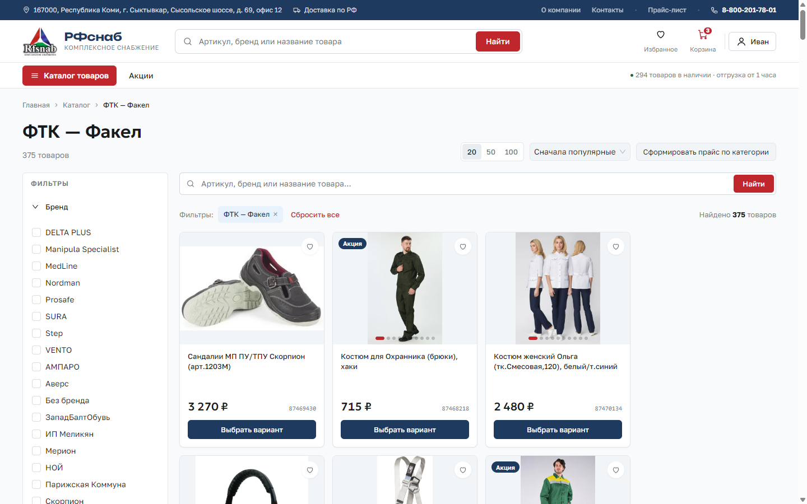](docs/screenshots/02-catalog-facets.png) |
| **Карточка товара: атрибуты и варианты** | **Корзина** |
| [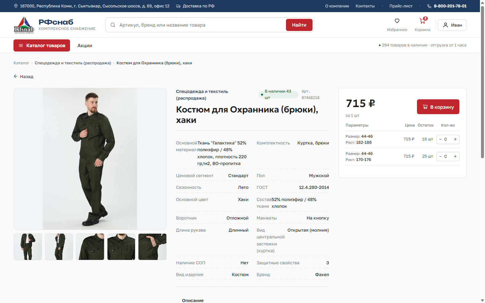](docs/screenshots/03-product.png) | [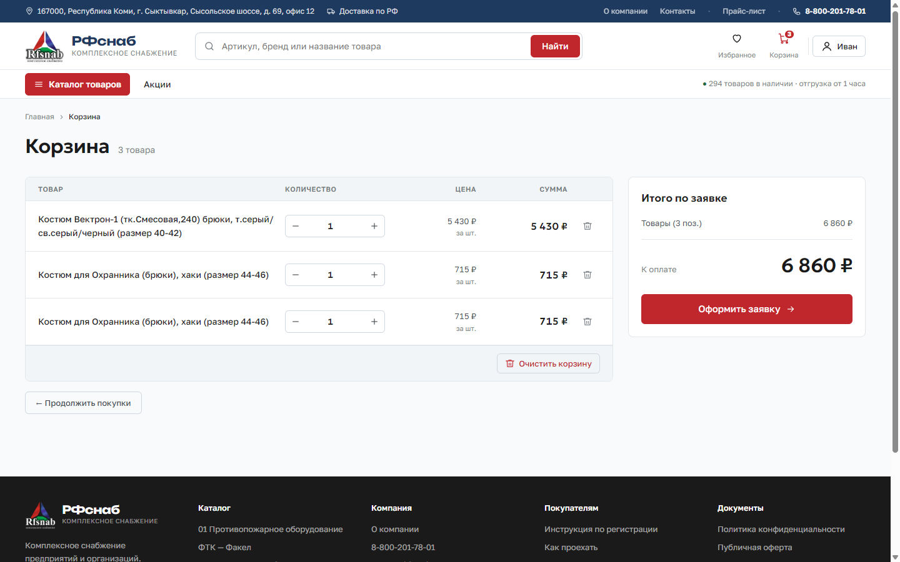](docs/screenshots/04-cart.png) |
| **Оформление заказа** | **Личный кабинет: заказы и статусы** |
| [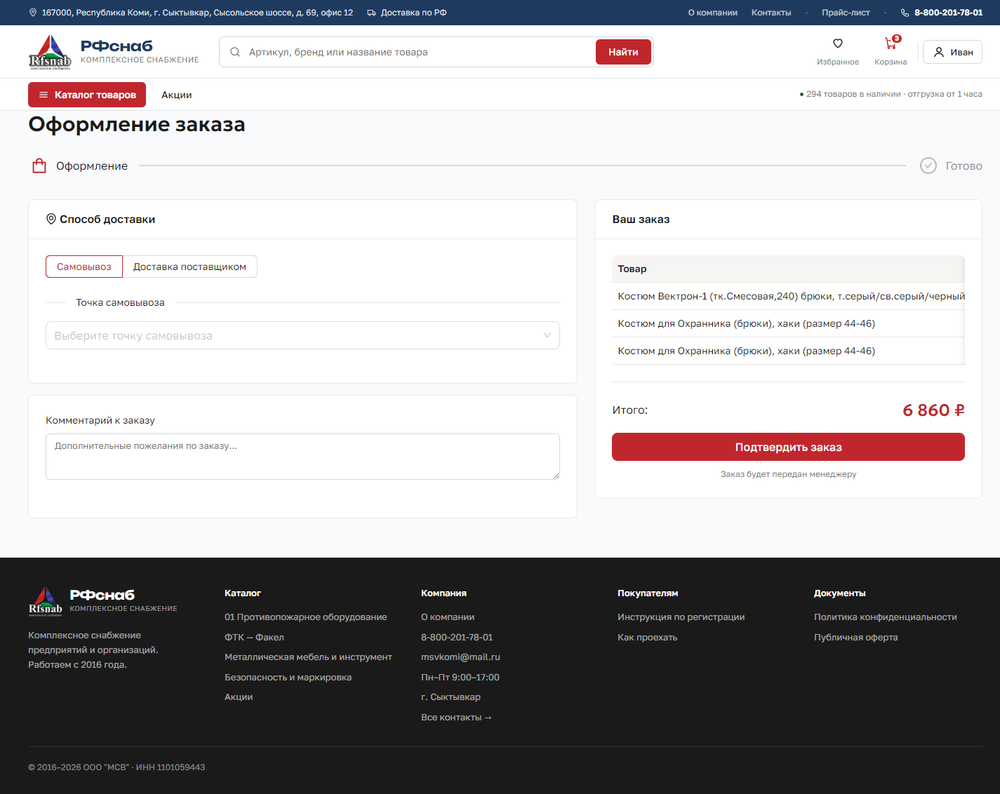](docs/screenshots/05-checkout.png) | [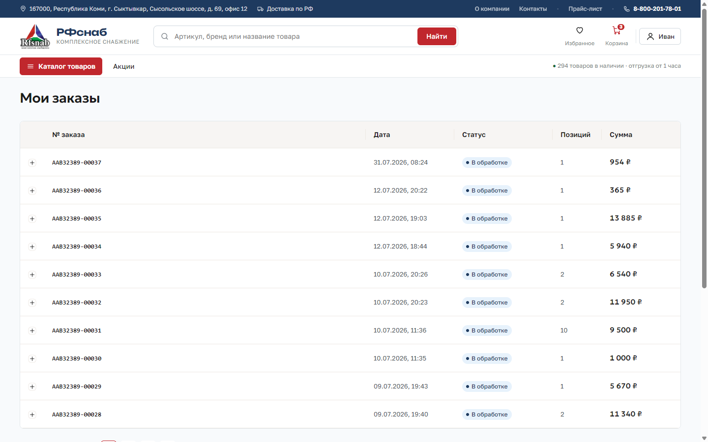](docs/screenshots/06-account-orders.png) |
| **Профиль: личные данные и B2B** | |
| [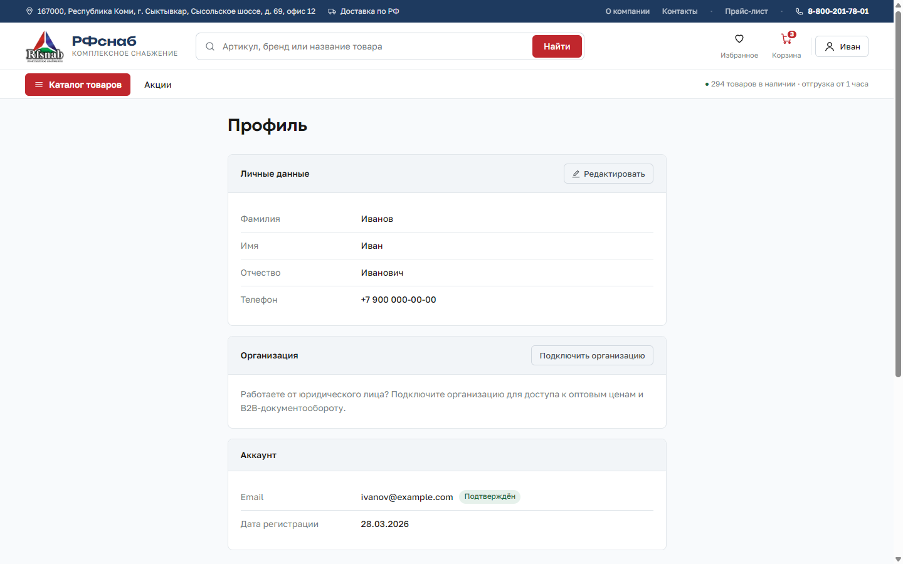](docs/screenshots/11-profile.png) | |

### Админка

| | |
|---|---|
| **Каталог: дерево категорий и drag-and-drop** | **Заказы: статусы, фильтры B2C/B2B** |
| [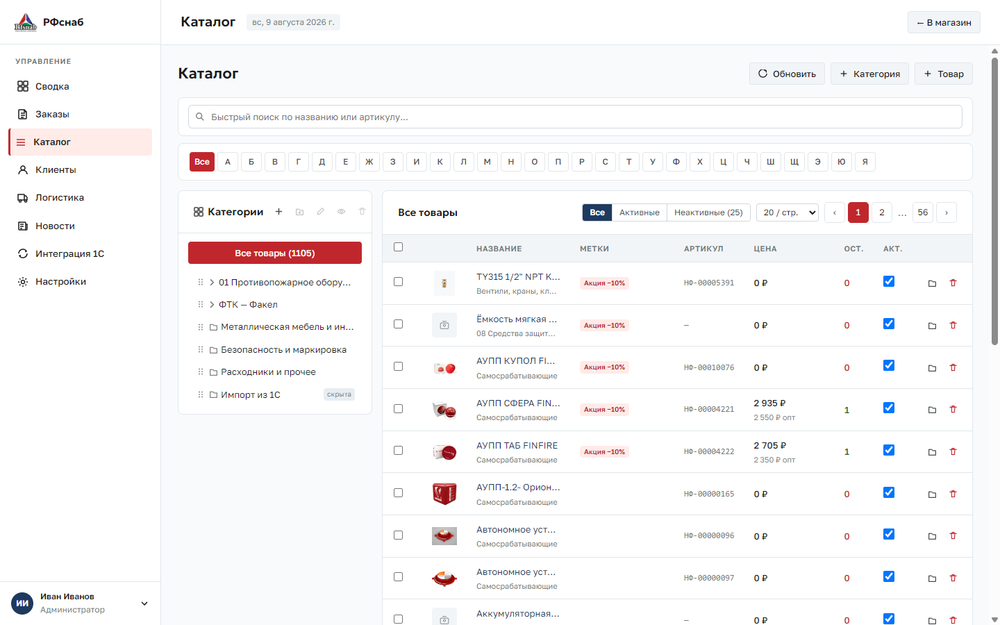](docs/screenshots/07-admin-catalog.png) | [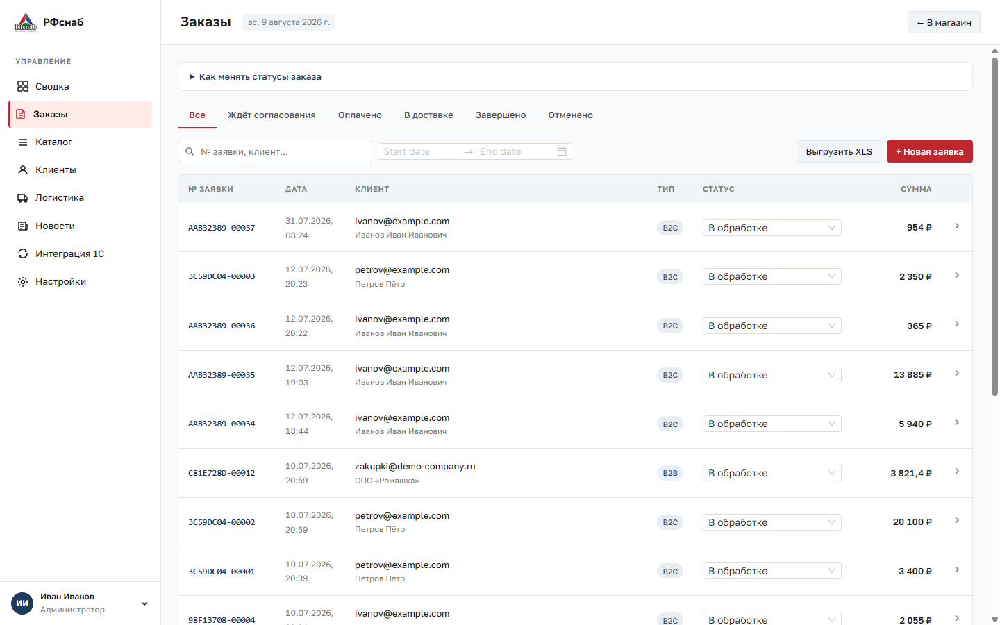](docs/screenshots/08-admin-orders.png) |
| **Интеграция 1С: история обменов** | **Мобильная версия** |
| [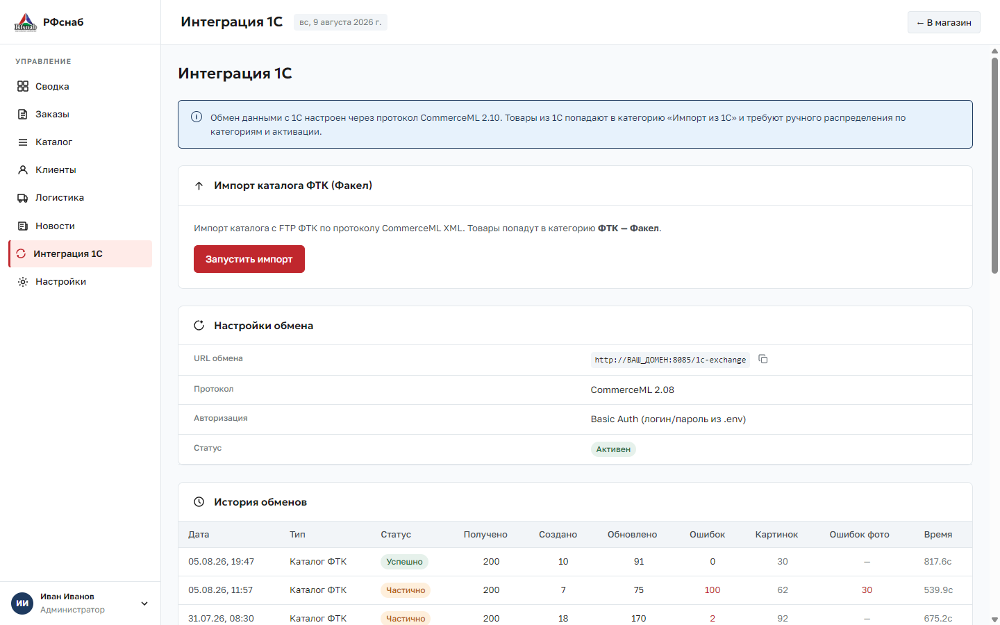](docs/screenshots/09-admin-import.png) | [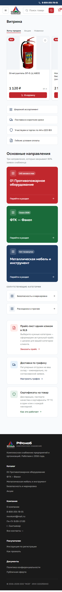](docs/screenshots/10-mobile.png) |

<sub>Скриншоты сняты на локальном стенде; имена, телефоны и e-mail на них — демонстрационные.</sub>

---

<p align="center">
  <sub>Разработка, инфраструктура и поддержка — <a href="https://github.com/elims777">elims777</a></sub>
</p>
